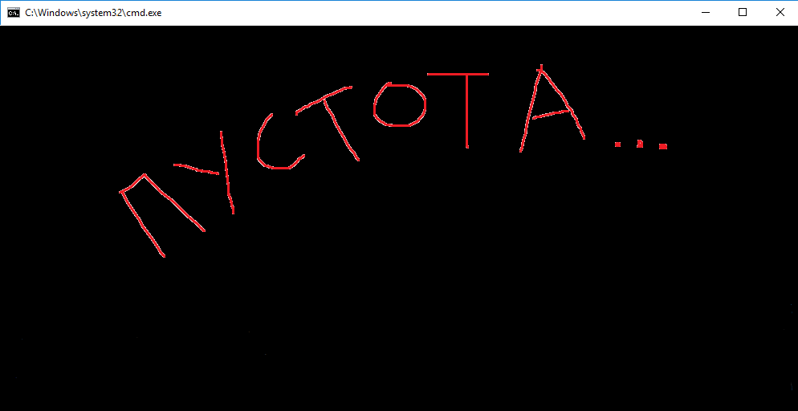

[<к содержанию](./readme.md)

## git clean

**git clean** - Команда git clean используется для удаления мусора из рабочей директории. Это могут быть результаты сборки проекта или файлы конфликтов слияний.

Используйте команду:

```bash=
git clean
```

Пример использования
