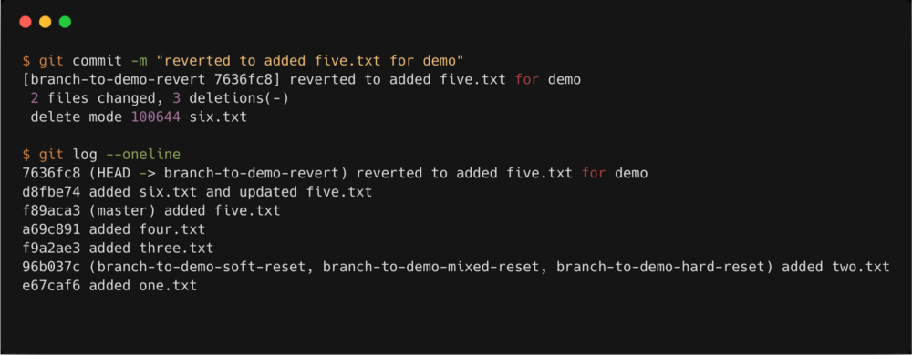

[<к содержанию](./readme.md)

## git commit

**git commit** - Команда git commit берёт все данные, добавленные в индекс с помощью git add, и сохраняет их слепок во внутренней базе данных, а затем сдвигает указатель текущей ветки на этот слепок.

Используйте команду:

```bash=
git commit
```
Пример использования
