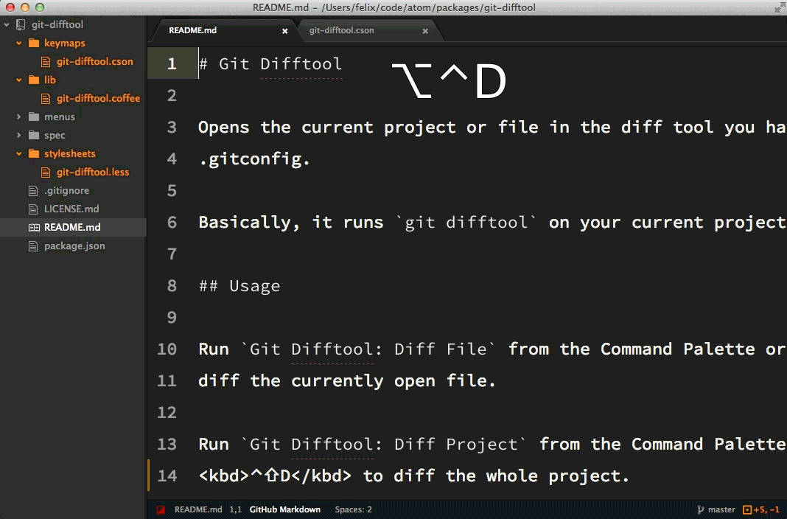

[<к содержанию](./readme.md)

## git difftool

**git difftool** - Команда git difftool просто запускает внешнюю утилиту сравнения для показа различий в двух деревьях, на случай если вы хотите использовать что-либо отличное от встроенного просмотрщика git diff.

Используйте команду:

```bash=
git difftool
```
Пример использования
