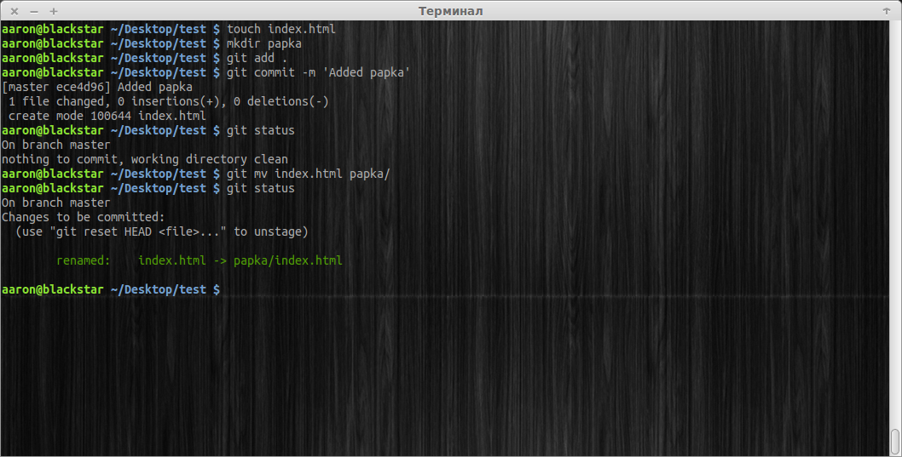

[<к содержанию](./readme.md)

## git mv

**git mv** - Команда git mv — это всего лишь удобный способ переместить файл, а затем выполнить git addдля нового файла и git rm для старого.

Используйте команду:

```bash=
git mv
```
Пример использования
