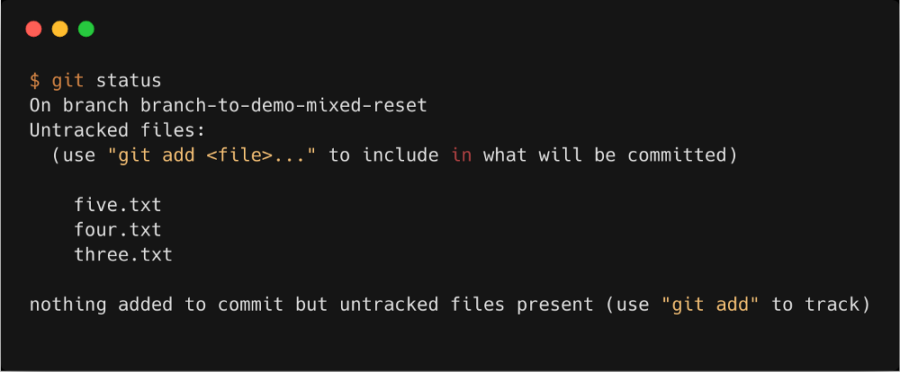

[<к содержанию](./readme.md)

## git status

**git status** - показывает состояния файлов в рабочей директории и индексе.
Какие файлы изменены, но не добавлены в индекс; какие ожидают коммита в индексе. Вдобавок к этому выводятся подсказки о том, как изменить состояние файлов.

Чтобы показать состояние файлов используйте команду:

```bash=
git status
```
Пример использования
